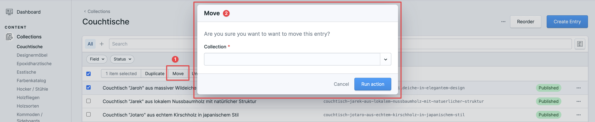
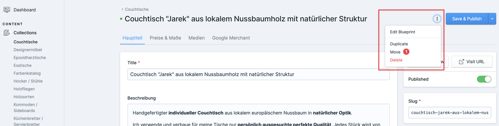

# Statamic Super Mover

> This package is a temporary fork of [codedge/statamic-move-entries](https://github.com/codedge/statamic-move-entries), originally created and maintained by Holger Lösken (Codedge). All credit goes to the upstream author—this fork only exists while we work through contributions and packaging under the new name.

Move entries from one collection to another in your Control Panel.

**Features:**

- Move one or multiple entries from one collection to another: available in list view and detail view  
- Confirmation question before moving
- German and English localized
- Config to set collections allowed to filter default is all

:warning: Multi-site support only for Statamic Eloquent entries at the moment. 

Built by [Codedge](https://github.com/codedge/statamic-move-entries). Eloquent driver support contributed by [Jelle Groenendal](https://github.com/JelleGroenendal).

## Fork status

This fork will stay closely aligned with upstream. Once our changes are merged or no longer needed, this package will be deprecated in favor of the original.

**Usage:**

In Statamic Control Panel go into one of your collections and select an entry. A new action called **Move** is going to show up.
Click this action and a popup will come up to let you select the target selection where you want to move your entry to.

## License

The MIT License (MIT). Please see [License File](LICENSE) for more information.
